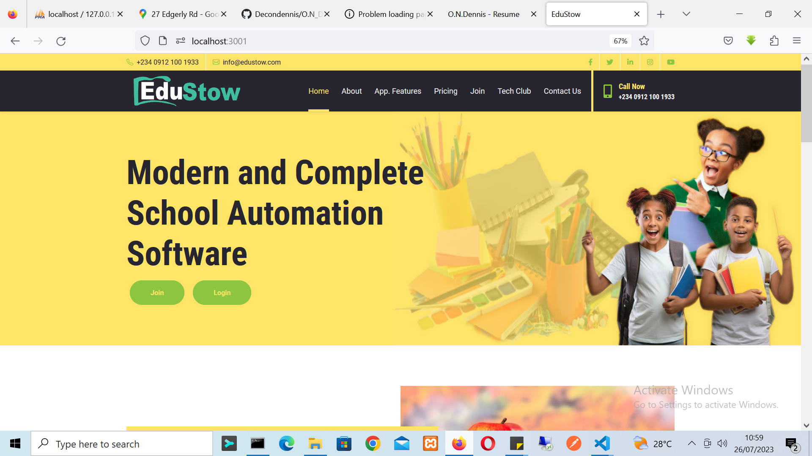
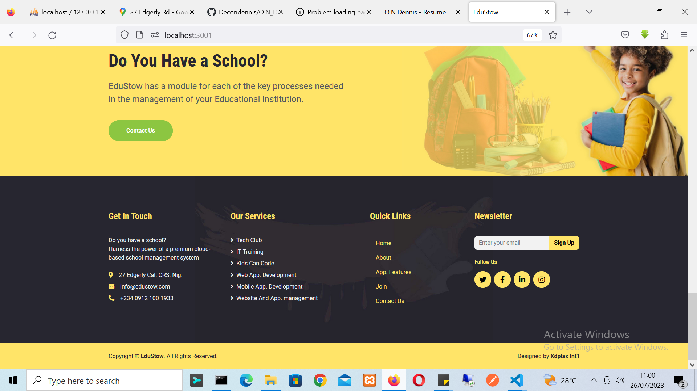

## Welcome to EduStow: Empowering Educational Institutions with Modern Web Solutions

EduStow is a comprehensive school web portal designed to revolutionize the way educational institutions manage and communicate with their stakeholders. EduStow provides a platform where users can access vital information about the portal, explore registration and subscription options, and contribute to the continuous improvement of the system.

Simplify, Stabilize, and Streamline Your School:
EduStow simplifies complex administrative tasks, stabilizes school operations, and streamlines processes, making it a game-changer for educational institutions. Our user-friendly interface and intuitive functionalities ensure that your school's management becomes more efficient and effective, saving valuable time and resources.

## Tech Stack Used in Edustow:

   ##  React:
   Edustow's frontend is powered by React, a widely-used JavaScript library for building interactive user interfaces. The use of React enables a dynamic and responsive web application for users.

    React Router: Edustow utilizes React Router to handle client-side routing. This enables smooth navigation between different pages without full-page reloads.

    React Hook Form: To manage form data efficiently, Edustow leverages React Hook Form. This library simplifies form handling and validation, enhancing the user experience.

   ## React Bootstrap:
   Edustow's UI components are designed using React Bootstrap, offering a sleek and consistent look across the application. It ensures a mobile-friendly experience for users on various devices.

    Axios: Edustow communicates with the backend server using Axios, a popular HTTP client library. Axios facilitates data exchange between the frontend and backend, ensuring seamless interactions.

   ## Node.js and Express:
   The backend of Edustow is built using Node.js and Express, forming a powerful and scalable foundation for server-side operations.

   ## MySQL Database: 
   Edustow stores its data in a MySQL database, ensuring efficient data management and data integrity.

   ## Bootstrap: 
   Edustow utilizes Bootstrap, a widely-used CSS framework, to enhance the layout and responsiveness of the website.

